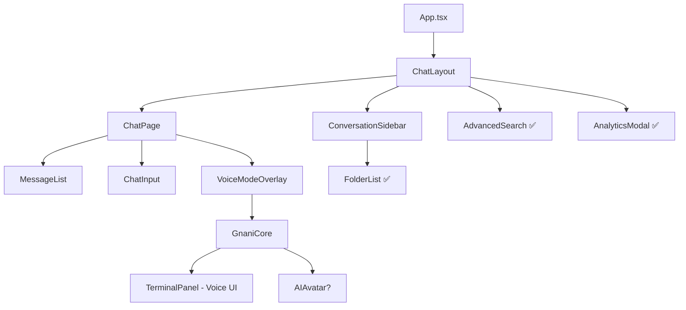

# 🔍 GNANI PROJECT - COMPREHENSIVE UI UPGRADE ANALYSIS (REVISED)

**Generated:** December 12, 2025  
**Scope:** Full Stack Deep Analysis (Frontend + Backend + Electron)  
**Objective:** Identify unused code, broken wiring, UI/UX issues, and create ChatGPT-style redesign plan

---

## 📌 1. EXECUTIVE SUMMARY

### Current State
Gnani is a **chat-first AI assistant** with optional voice mode, built with:
- **Frontend:** React 19 + TypeScript + Electron + Zustand + XState + TailwindCSS
- **Backend:** Node.js + Express + MongoDB + Redis + gRPC + Whisper + LLM
- **Architecture:** Microservices with real-time streaming

### Architecture Migration Status
✅ **Successfully migrated from voice-first to chat-first**
- Main UI: `ChatLayout` → `ConversationSidebar` + `ChatPage` (chat components)
- Voice UI: `GnaniCore` → `TerminalPanel` (voice-first legacy, still used for voice mode)

### Major Issues Identified
- 🔴 **Critical:** `chat/Sidebar.tsx` is UNUSED - `ConversationSidebar` is the active implementation
- 🔴 **Critical:** Terminal components are voice-first legacy but still actively used in voice mode
- 🔴 **Critical:** Avatar components exist but usage needs verification
- ✅ **GOOD:** AdvancedSearch IS integrated (Cmd+K shortcut in ChatLayout)
- ✅ **GOOD:** FolderList IS integrated (in ConversationSidebar lines 201-204)
- ⚠️ **Medium:** Plugin marketplace components not needed (can deprecate)

---

## 🏗️ 2. ARCHITECTURE BREAKDOWN

### Current UI Architecture



### Tech Stack

#### Frontend (React)
```
Core: React 19.2.0, TypeScript 5.9.3, Vite 7.2.2
State: Zustand 5.0.9 (15 stores) + XState 5.25.0 (1 machine)
UI: TailwindCSS 4.1.17, Framer Motion 12.23.24
Desktop: Electron 39.2.2
Audio: Picovoice Porcupine 3.0.3
Testing: Vitest 4.0.15, Playwright 1.57.0
```

### Component Usage Analysis

#### ✅ ACTIVE - Chat-First Components
1. **`layouts/ChatLayout.tsx`** - Main layout (uses ConversationSidebar)
2. **`pages/ChatPage.tsx`** - Chat interface
3. **`components/conversation/ConversationSidebar.tsx`** - ✅ ACTIVE sidebar with folders
4. **`components/chat/MessageList.tsx`** - Message display
5. **`components/chat/ChatInput.tsx`** - Input area
6. **`components/chat/ChatHeader.tsx`** - Header
7. **`components/common/AdvancedSearch.tsx`** - ✅ INTEGRATED (Cmd+K)
8. **`components/common/FolderList.tsx`** - ✅ INTEGRATED (in ConversationSidebar)

#### ⚠️ VOICE-FIRST LEGACY - Still Used for Voice Mode
1. **`components/terminal/TerminalPanel.tsx`** (19KB, 427 lines)
   - Used in `GnaniCore` for voice mode
   - Has advanced features: BranchTree, MessageBubble, InlineMessageEditor
   - **Question:** Are these features duplicated in chat components?

2. **Terminal Sub-components** (30 files):
   - `MessageBubble.tsx` (17KB) - Rich message rendering
   - `BranchTree.tsx` - Message branching visualization
   - `InlineMessageEditor.tsx` - Edit messages inline
   - `GenerationNavigator.tsx` - Navigate between generations
   - `CodeBlock.tsx` - Code syntax highlighting
   - `MermaidDiagram.tsx` - Diagram rendering
   - `ImageGallery.tsx`, `ImagePreview.tsx` - Image handling
   - `ModelSelector.tsx`, `TemplateSelector.tsx` - Model/template selection
   - `TextInput.tsx` (8KB) - Advanced input with attachments
   - `AttachedFilesList.tsx`, `FileUploadZone.tsx` - File handling
   - `StateIndicator.tsx`, `ActionIndicator.tsx` - Status display
   - `TypingIndicator.tsx` - Typing animation
   - `DateSeparator.tsx`, `MessageTimestamp.tsx` - Time display

#### 🔴 DEPRECATED - Unused Components

1. **`components/chat/Sidebar.tsx`** (17KB, 344 lines) - ❌ NOT USED
   - **Reason:** ChatLayout uses `ConversationSidebar` instead (line 82-87)
   - **Features:** Search, conversation list, user profile
   - **Action:** Move to deprecated - it's a duplicate

2. **Plugin Components** - ❌ NOT NEEDED
   - `components/common/PluginMarketplace.tsx`
   - `components/common/PluginCard.tsx`
   - **Reason:** User confirmed plugin marketplace not needed

3. **Avatar Components** - ⚠️ NEEDS VERIFICATION
   - `components/gnani/avatar/GnaniAvatar.tsx`
   - `components/gnani/avatar/RealHumanAvatar.tsx`
   - `components/gnani/avatar/AvatarContainer.tsx`
   - `components/gnani/avatar/LipSyncEngine.ts`
   - `components/gnani/avatar/AvatarConfig.ts`
   - **Status:** Found in code but need to verify if used in GnaniCore

---

## 🗂 3. DEPRECATED ITEMS LIST (REVISED)

### 🔴 MOVE TO `deprecated/` IMMEDIATELY

#### 1. Unused Sidebar
**File:** `components/chat/Sidebar.tsx` (17KB)
**Reason:** ChatLayout uses `ConversationSidebar` instead
**Evidence:** 
- ChatLayout line 82: `<ConversationSidebar`
- No imports of `chat/Sidebar` found in codebase
**Action:** Move to deprecated

#### 2. Plugin Components
**Files:**
- `components/common/PluginMarketplace.tsx`
- `components/common/PluginCard.tsx`

**Reason:** User confirmed not needed
**Action:** Move to deprecated

#### 3. Avatar Components (Pending Verification)
**Files:**
- `components/gnani/avatar/*` (5 files)

**Reason:** User wants to deprecate, but need to verify not used in GnaniCore
**Action:** Verify usage, then move to deprecated

#### 4. Backup Files
**File:** `store/useConversationStore.ts.backup` (35KB)
**Reason:** Old refactoring artifact
**Action:** Delete

### ⚠️ TERMINAL COMPONENTS - SPECIAL CASE

**Status:** Voice-first legacy BUT still actively used in voice mode
**Files:** `components/terminal/*` (30 files, including TerminalPanel.tsx)

**Analysis:**
- TerminalPanel is imported in `GnaniCore.tsx` (voice mode)
- Has advanced features that may not exist in chat components:
  - **BranchTree** - Message branching visualization
  - **InlineMessageEditor** - Edit messages inline
  - **GenerationNavigator** - Navigate between message generations
  - **Rich MessageBubble** (17KB) - More advanced than chat/MessageItem?

**Decision Required:**
1. **Option A:** Keep terminal components for voice mode (dual UI)
2. **Option B:** Migrate terminal features to chat components, deprecate terminal
3. **Option C:** Merge best features from both into unified component library

**Recommendation:** Need to compare `terminal/MessageBubble.tsx` vs `chat/MessageItem.tsx` to see feature gaps

---

## 🐞 4. FUNCTIONAL ISSUES

### ✅ RESOLVED - Previously Reported as Broken

1. **✅ FolderList IS Integrated**
   - Location: `ConversationSidebar.tsx` lines 201-204
   - Features: Folder tree, expand/collapse, drag-drop
   - Status: WORKING

2. **✅ AdvancedSearch IS Integrated**
   - Location: `ChatLayout.tsx` lines 67-77
   - Trigger: Cmd+K / Ctrl+K keyboard shortcut
   - Status: WORKING

### 🔴 CRITICAL - Actual Issues

#### 1. Dual Sidebar Implementations
**Issue:** Two sidebar components exist, only one is used
- **Active:** `conversation/ConversationSidebar.tsx` (21KB, with folders)
- **Unused:** `chat/Sidebar.tsx` (17KB, simpler version)
**Impact:** Code confusion, maintenance burden
**Fix:** Delete unused `chat/Sidebar.tsx`

#### 2. Terminal vs Chat Feature Parity
**Issue:** Terminal components have advanced features not in chat
**Examples:**
- `terminal/MessageBubble.tsx` (17KB) vs `chat/MessageItem.tsx` (9KB)
- `terminal/BranchTree.tsx` - No equivalent in chat
- `terminal/InlineMessageEditor.tsx` - No equivalent in chat
- `terminal/GenerationNavigator.tsx` - No equivalent in chat

**Impact:** Voice mode has better UX than chat mode
**Fix:** Need feature comparison and migration plan

#### 3. Avatar Component Usage Unclear
**Issue:** Avatar components exist but usage not verified
**Files:** 5 avatar files in `components/gnani/avatar/`
**Impact:** May be dead code
**Fix:** Verify usage in GnaniCore, deprecate if unused

### ⚠️ HIGH PRIORITY - State Management

#### 4. Conversation Store Refactoring
**File:** `store/useConversationStore.ts` (now just 4 lines, re-exports from `conversation/`)
**Issue:** Recent major refactoring, 35KB backup file exists
**Impact:** Potential import issues, state sync problems
**Fix:** Audit all imports, delete backup

---

## 🎨 5. UI/UX WEAKNESS ANALYSIS

### Current Chat Interface (ChatGPT Comparison)

#### ✅ GOOD - What's Working

1. **ConversationSidebar** (21KB)
   - ✅ Folder organization with expand/collapse
   - ✅ Search functionality
   - ✅ Sort options (date, name, message count)
   - ✅ Infinite scroll pagination
   - ✅ Rename/delete conversations
   - ✅ Drag-drop to folders

2. **ChatPage**
   - ✅ Message list with virtualization
   - ✅ Chat input with attachments
   - ✅ Voice mode overlay

3. **Advanced Features**
   - ✅ Advanced search (Cmd+K)
   - ✅ Analytics modal
   - ✅ Undo/redo system

#### ⚠️ NEEDS IMPROVEMENT - Gaps vs ChatGPT

1. **Message Actions**
   - ChatGPT: Hover shows copy, edit, regenerate, branch
   - Gnani: Basic actions, no branching visualization in chat mode
   - **Terminal has this:** `BranchTree.tsx`, `GenerationNavigator.tsx`

2. **Message Editing**
   - ChatGPT: Inline editing with smooth transitions
   - Gnani: Basic editing
   - **Terminal has this:** `InlineMessageEditor.tsx`

3. **Code Blocks**
   - ChatGPT: Syntax highlighting, copy button, language badge
   - Gnani: Basic rendering
   - **Terminal has this:** `CodeBlock.tsx` with syntax highlighting

4. **Input Area**
   - ChatGPT: Multi-line auto-expand, attachment previews, shortcuts
   - Gnani: Basic input
   - **Terminal has this:** `TextInput.tsx` (8KB) with advanced features

5. **Visual Design**
   - ChatGPT: Clean, minimal, excellent spacing
   - Gnani: Jarvis/cyberpunk theme (cyan/dark)
   - **Issue:** Theme is distinctive but may not be as clean as ChatGPT

### Layout Comparison

**ChatGPT Layout:**
```
┌─────────────┬───────────────────────────────────────┐
│  Sidebar    │  Header                               │
│  ─────────  ├───────────────────────────────────────┤
│  Search     │                                       │
│  ─────────  │  Messages                             │
│  Conv 1     │  • User message                       │
│  Conv 2     │  • AI response [Copy][Regen][Edit]    │
│  Conv 3     │  • Code blocks with syntax            │
│             │                                       │
│  [+ New]    │                                       │
│             ├───────────────────────────────────────┤
│             │  [Type message... 📎]                 │
└─────────────┴───────────────────────────────────────┘
```

**Gnani Current Layout:**
```
┌─────────────┬───────────────────────────────────────┐
│  ConvSidebar│  ChatHeader                           │
│  ─────────  ├───────────────────────────────────────┤
│  Search     │                                       │
│  Folders    │  MessageList                          │
│  📁 Work    │  • Messages (basic)                   │
│  📁 Code    │                                       │
│  ─────────  │                                       │
│  Conv 1     │                                       │
│  Conv 2     │                                       │
│             ├───────────────────────────────────────┤
│  [+ New]    │  ChatInput (basic)                    │
└─────────────┴───────────────────────────────────────┘
```

**Gap:** Gnani layout is similar, but message-level features are less polished

---

## 🆕 6. THE NEW UI/UX BLUEPRINT (CHATGPT-STYLE)

### Design Philosophy
**Goal:** Clean, minimal, ChatGPT-inspired interface for chat-first experience
**Inspiration:** ChatGPT, Gemini 2, Claude 3.5
**Approach:** Modular component library, unified design system

### High-Level Layout Design (ChatGPT-Style)

```
┌──────────────┬────────────────────────────────────────────┐
│ [☰] Gnani   │  Conversation Title            [⋮]        │
├──────────────┼────────────────────────────────────────────┤
│              │                                            │
│ [🔍 Search]  │  ┌──────────────────────────────────────┐ │
│              │  │ User: How do I...                    │ │
│ 📁 Folders   │  │ [Copy][Edit]                         │ │
│  └ Work (5)  │  └──────────────────────────────────────┘ │
│  └ Code (3)  │                                            │
│              │  ┌──────────────────────────────────────┐ │
│ Recent       │  │ AI: Here's how...                    │ │
│ ──────────   │  │ ```python                            │ │
│ Conv 1       │  │ def example():                       │ │
│ Conv 2       │  │     return "Hello"                   │ │
│ Conv 3       │  │ ```                                  │ │
│              │  │ [Copy][Regen][Branch]                │ │
│ [+ New Chat] │  └──────────────────────────────────────┘ │
│              │                                            │
│ [Profile]    │  [Type a message... 📎 🎤]                │
└──────────────┴────────────────────────────────────────────┘
```

### Component-Level Design

#### 1. **Sidebar Enhancement** (Keep ConversationSidebar, improve it)

**Current:** ConversationSidebar is good, just needs polish
**Improvements:**
- ✅ Keep folder tree (already implemented)
- ✅ Keep search (already implemented)
- ✅ Keep sort options (already implemented)
- 🔧 Add: Conversation preview (first message snippet)
- 🔧 Add: Model badge per conversation
- 🔧 Add: Bulk actions (select multiple, delete/move)
- 🔧 Add: Pin conversations to top
- 🔧 Improve: Visual design (less cyberpunk, more clean)

#### 2. **Message Display** (Migrate Terminal Features to Chat)

**Current:** `chat/MessageItem.tsx` (9KB) is basic
**Upgrade:** Migrate features from `terminal/MessageBubble.tsx` (17KB)

**Features to Migrate:**
- ✅ Rich markdown rendering (Mermaid, KaTeX)
- ✅ Code blocks with syntax highlighting (`CodeBlock.tsx`)
- ✅ Inline message actions on hover
- ✅ Message branching visualization (`BranchTree.tsx`)
- ✅ Generation navigator (`GenerationNavigator.tsx`)
- ✅ Inline editing (`InlineMessageEditor.tsx`)
- ✅ Image gallery (`ImageGallery.tsx`, `ImagePreview.tsx`)
- ✅ Date separators (`DateSeparator.tsx`)
- ✅ Typing indicator (`TypingIndicator.tsx`)

**New Component:** `components/chat/EnhancedMessageItem.tsx`
- Merge best of `MessageItem` + `MessageBubble`
- ChatGPT-style hover actions
- Smooth animations

#### 3. **Input Area Enhancement**

**Current:** `chat/ChatInput.tsx` (6KB) is basic
**Upgrade:** Migrate features from `terminal/TextInput.tsx` (8KB)

**Features to Migrate:**
- ✅ Multi-line auto-expand
- ✅ Attachment previews (`AttachedFilesList`, `ImageGallery`)
- ✅ Model/template selector (`ModelSelector`, `TemplateSelector`)
- ✅ Drag-drop file upload (`FileUploadZone`)
- ✅ Keyboard shortcuts (Cmd+Enter to send)
- ✅ Character/token counter
- ✅ Stop generation button (already has)

**New Component:** `components/chat/EnhancedChatInput.tsx`

#### 4. **Voice Mode** (Keep Separate, Improve)

**Current:** `GnaniCore` + `TerminalPanel` for voice mode
**Decision:** Keep voice mode separate (different UX paradigm)
**Improvements:**
- ✅ Keep terminal UI for voice mode (it's good)
- 🔧 Improve: Avatar integration (if keeping avatars)
- 🔧 Improve: Waveform visualization
- 🔧 Improve: Barge-in visual feedback

#### 5. **Design System**

**Colors (ChatGPT-inspired):**
```css
/* Light Mode */
--bg-primary: #FFFFFF
--bg-secondary: #F7F7F8
--text-primary: #000000
--text-secondary: #6B6B6B
--border: #E5E5E5
--accent: #10A37F (green)

/* Dark Mode */
--bg-primary: #212121
--bg-secondary: #2F2F2F
--text-primary: #ECECEC
--text-secondary: #B4B4B4
--border: #4D4D4D
--accent: #19C37D
```

**Typography:**
```css
--font-sans: 'Inter', system-ui, sans-serif
--font-mono: 'Fira Code', monospace

--text-xs: 0.75rem
--text-sm: 0.875rem
--text-base: 1rem
--text-lg: 1.125rem
--text-xl: 1.25rem
```

**Spacing:**
```css
--space-1: 0.25rem
--space-2: 0.5rem
--space-3: 0.75rem
--space-4: 1rem
--space-6: 1.5rem
--space-8: 2rem
```

---

## 🧠 7. IMPLEMENTATION ROADMAP (MULTI-STAGE)

### Phase 1: Cleanup & Deprecation (1 week)

**Goal:** Remove dead code, organize deprecated items

**Tasks:**
1. Create `deprecated/` folder structure
2. Move `chat/Sidebar.tsx` to deprecated
3. Move plugin components to deprecated
4. Verify avatar usage, move to deprecated if unused
5. Delete `useConversationStore.ts.backup`
6. Audit all imports after moves
7. Run tests to ensure nothing broke

**Deliverables:**
- Clean codebase
- Deprecation report
- All tests passing

---

### Phase 2: Feature Parity Analysis (3-5 days)

**Goal:** Compare terminal vs chat components, create migration plan

**Tasks:**
1. **Compare Components:**
   - `terminal/MessageBubble.tsx` (17KB) vs `chat/MessageItem.tsx` (9KB)
   - `terminal/TextInput.tsx` (8KB) vs `chat/ChatInput.tsx` (6KB)
   - List all terminal features not in chat

2. **Create Feature Matrix:**
   ```
   Feature                  | Terminal | Chat | Action
   ─────────────────────────┼──────────┼──────┼────────
   Syntax highlighting      | ✅       | ❌   | Migrate
   Branch visualization     | ✅       | ❌   | Migrate
   Inline editing           | ✅       | ❌   | Migrate
   Generation navigator     | ✅       | ❌   | Migrate
   Rich attachments         | ✅       | ❌   | Migrate
   Model selector in input  | ✅       | ❌   | Migrate
   ```

3. **Design Unified Components:**
   - `EnhancedMessageItem.tsx` (merge MessageItem + MessageBubble)
   - `EnhancedChatInput.tsx` (merge ChatInput + TextInput)

**Deliverables:**
- Feature comparison matrix
- Component design specs
- Migration plan document

---

### Phase 3: Component Library Unification (2-3 weeks)

**Goal:** Create unified component library with best features from both

**Tasks:**
1. **Create Enhanced Message Component**
   - Merge `MessageItem` + `MessageBubble`
   - Add hover actions (copy, edit, regenerate, branch)
   - Add inline editing
   - Add branch visualization
   - Add generation navigator
   - Improve code blocks with `CodeBlock.tsx` features

2. **Create Enhanced Input Component**
   - Merge `ChatInput` + `TextInput`
   - Add multi-line auto-expand
   - Add attachment previews
   - Add model/template selector
   - Add keyboard shortcuts
   - Add token counter

3. **Create Shared Sub-components:**
   - `CodeBlock.tsx` (reuse from terminal)
   - `ImageGallery.tsx` (reuse from terminal)
   - `DateSeparator.tsx` (reuse from terminal)
   - `TypingIndicator.tsx` (reuse from terminal)

4. **Update ChatPage:**
   - Replace `MessageList` → use `EnhancedMessageItem`
   - Replace `ChatInput` → use `EnhancedChatInput`

**Deliverables:**
- Unified component library
- ChatPage using new components
- Terminal components marked as voice-mode only

---

### Phase 4: ChatGPT-Style UI Polish (2-3 weeks)

**Goal:** Polish UI to ChatGPT quality

**Tasks:**
1. **Design System Implementation**
   - Create color tokens (light/dark themes)
   - Create typography scale
   - Create spacing system
   - Update TailwindCSS config

2. **Sidebar Polish**
   - Add conversation previews
   - Add model badges
   - Add bulk actions
   - Add pin functionality
   - Improve visual design (cleaner, less cyberpunk)

3. **Message Display Polish**
   - Smooth hover animations
   - Better spacing and typography
   - Improved code block styling
   - Better image handling

4. **Input Area Polish**
   - Better attachment previews
   - Smooth expand/collapse
   - Better button styling
   - Improved accessibility

5. **Animations**
   - Page transitions
   - Message appearance
   - Hover effects
   - Loading states

**Deliverables:**
- ChatGPT-quality UI
- Light/dark themes
- Smooth animations
- Polished interactions

---

### Phase 5: Voice Mode Integration (1-2 weeks)

**Goal:** Ensure voice mode works with new architecture

**Tasks:**
1. **Verify Voice Mode:**
   - Test `GnaniCore` + `TerminalPanel`
   - Ensure voice mode still works
   - Test avatar integration (if keeping)

2. **Improve Voice Mode:**
   - Better waveform visualization
   - Better barge-in feedback
   - Smooth transitions to/from chat mode

3. **Decide on Terminal Components:**
   - Option A: Keep terminal for voice mode only
   - Option B: Migrate voice mode to use new components
   - **Recommendation:** Keep terminal for voice mode (different UX)

**Deliverables:**
- Working voice mode
- Voice mode documentation
- Decision on terminal component future

---

## 📋 IMMEDIATE ACTION ITEMS

### Week 1: Cleanup
1. ✅ Create `deprecated/` folder
2. ✅ Move `chat/Sidebar.tsx` to deprecated
3. ✅ Move plugin components to deprecated
4. ✅ Verify avatar usage (check GnaniCore imports)
5. ✅ Delete backup files
6. ✅ Run tests

### Week 2: Analysis
1. ✅ Compare terminal vs chat components
2. ✅ Create feature matrix
3. ✅ Design unified components
4. ✅ Get user approval on approach

### Week 3-4: Implementation
1. ✅ Create `EnhancedMessageItem`
2. ✅ Create `EnhancedChatInput`
3. ✅ Update ChatPage
4. ✅ Test integration

### Week 5-6: Polish
1. ✅ Implement design system
2. ✅ Polish sidebar
3. ✅ Polish messages
4. ✅ Polish input
5. ✅ Add animations

---

## 🎯 SUCCESS METRICS

- **Code Quality:** Remove 2 unused components (Sidebar, plugins), clean deprecated code
- **Feature Parity:** Chat mode has all terminal features
- **UX Quality:** Match ChatGPT interaction quality
- **Performance:** <100ms UI response time, <2s message load
- **Bugs:** 0 critical, <5 high priority

---

## ❓ QUESTIONS FOR USER

1. **Avatar Components:** Should we keep or deprecate `components/gnani/avatar/*`?
   - Need to verify if used in GnaniCore
   - If not used, move to deprecated

2. **Terminal Components:** What should we do with terminal components?
   - **Option A:** Keep for voice mode only (recommended)
   - **Option B:** Migrate voice mode to use new unified components
   - **Option C:** Deprecate entirely (not recommended - voice mode needs different UX)

3. **Theme:** Should we keep the Jarvis/cyberpunk theme or move to ChatGPT-style clean design?
   - Current: Cyan/dark cyberpunk
   - Proposed: Clean, minimal, light/dark modes

---

**End of Report**
