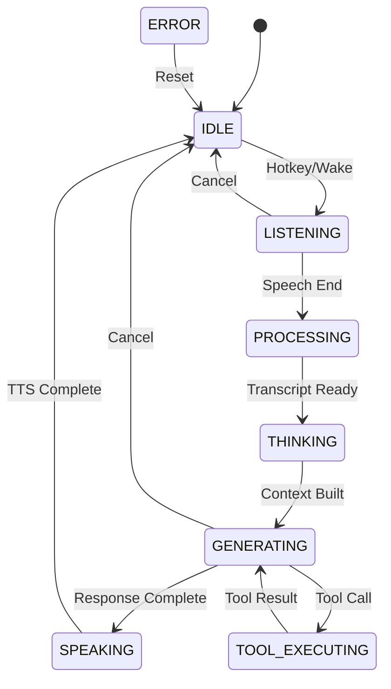
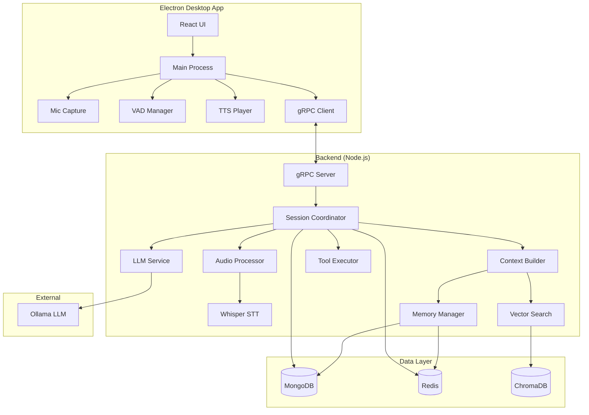
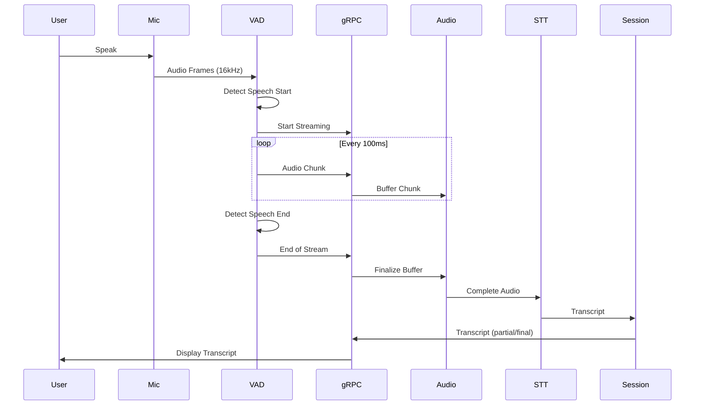
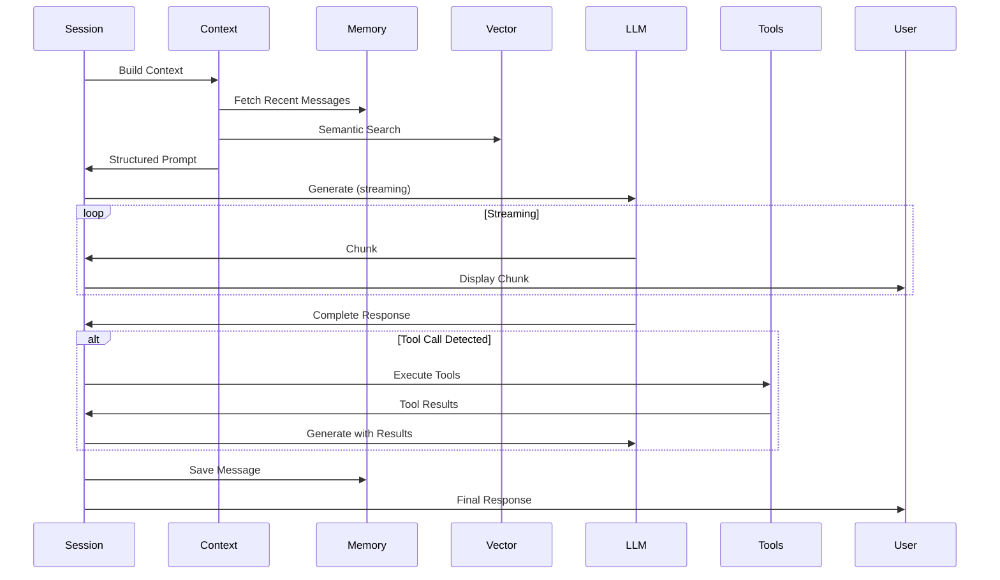

# Single-LLM Gnani Foundation Report

**Version:** 1.0  
**Date:** December 8, 2025  
**Status:** Production-Grade Architecture Analysis

---

## Executive Summary

Gnani is an OS-level AI assistant built with Electron (desktop), React (frontend), and Node.js/TypeScript (backend). This report analyzes the current single-LLM architecture, identifies critical gaps, and provides a roadmap for building a rock-solid foundation that is future-proof for multi-agent expansion.

**Current State:** Functional prototype with real-time audio/text processing, tool execution, memory management, and vector search.

**Critical Gaps:** Session recovery fragility, inconsistent error handling, missing production monitoring, no deterministic state machine, audio pipeline optimization needed.

**Goal:** Transform into a production-grade single-LLM system with 99.9% uptime, sub-200ms latency, and clean abstractions for future multi-agent upgrade.

---

## 1. Current Architecture Analysis

### 1.1 Frontend Architecture (Electron + React)

#### **Electron Main Process** (`electron/main.js`)
- **Role:** OS integration, audio capture, IPC coordination
- **Components:**
  - `MicCapture`: Microphone access via native APIs
  - `WakeManager`: Wake word detection (always-listening mode)
  - `VadManager`: Voice Activity Detection (speech/silence)
  - `StreamingClient`: gRPC client for backend communication
  - `TtsPlayer`: Text-to-speech audio playback
  - `OSAwarenessManager`: System state monitoring (active window, battery, connectivity)
  - `NotificationManager`: System notifications

**Strengths:**
- ✅ Clean separation of concerns (audio, VAD, streaming, TTS)
- ✅ Global hotkey support (Cmd+Shift+Space)
- ✅ System tray integration
- ✅ Screenshot capture capability
- ✅ Graceful error handling with try-catch blocks

**Issues:**
- ❌ No deterministic state machine (mic states managed ad-hoc)
- ❌ Barge-in logic scattered across files
- ❌ Missing reconnection logic for gRPC failures
- ❌ No audio preprocessing (AEC/NS/AGC) for quality
- ❌ Hardcoded 16kHz sample rate (Whisper requirement, but inflexible)

#### **React Frontend** (`react/src/`)
- **State Management:** Zustand stores
  - `useConversationStore`: Messages, streaming, regeneration
  - `useGnaniStore`: Mic state, assistant state
  - `useUserStore`: Auth, profile, preferences
  - `useConversationHistoryStore`: Conversation list
  - `themeStore`: UI theme

- **Key Components:**
  - `ConversationTerminal`: Chat UI with streaming support
  - `AudioVisualizer`: Real-time audio waveform
  - `ToolExecutionPanel`: Tool status display
  - `SettingsPanel`: User preferences, model selection

**Strengths:**
- ✅ Zustand provides clean, performant state management
- ✅ Streaming UI updates via gRPC callbacks
- ✅ Optimistic UI updates for better UX
- ✅ Error boundaries for crash recovery

**Issues:**
- ❌ No offline mode or queue for failed requests
- ❌ WebSocket fallback not implemented
- ❌ State persistence incomplete (loses state on refresh)
- ❌ No retry logic for failed API calls
- ❌ Missing loading skeletons for better perceived performance

### 1.2 Backend Architecture (Node.js/TypeScript)

#### **Core Modules** (`src/modules/`)

**Session Coordinator** (`session/session.coordinator.ts`)
- **Role:** Orchestrates audio → STT → context → LLM → tools flow
- **Key Methods:**
  - `startSession()`: Initialize session, create conversation
  - `processAudioChunk()`: Buffer audio, trigger STT
  - `processTranscript()`: Filter noise, trigger LLM
  - `handleFinalTranscript()`: Context building, LLM generation, tool execution
  - `processTextInput()`: Handle text-only queries
  - `cancelStream()`: Abort ongoing LLM generation

**Strengths:**
- ✅ Clean orchestration layer
- ✅ Session recovery from Redis
- ✅ Graceful degradation (fallback to simple context if RAG fails)
- ✅ AbortController for stream cancellation
- ✅ Transcript validation (filters noise, non-speech sounds)

**Issues:**
- ❌ Session timeout (30 min) too aggressive for long conversations
- ❌ No session persistence to disk (only Redis)
- ❌ Missing circuit breaker for external dependencies
- ❌ Tool execution not parallelized (sequential only)
- ❌ No request deduplication

**LLM Service** (`llm/llm.service.ts`)
- **Role:** Interface to local LLM (Ollama/llama.cpp)
- **Features:**
  - Streaming support with stabilization buffer
  - Response caching (Redis, 1 hour TTL)
  - Circuit breaker for fault tolerance
  - Token counting and usage tracking
  - Multi-modal support (text + images)

**Strengths:**
- ✅ Circuit breaker prevents cascade failures
- ✅ Retry with exponential backoff
- ✅ Smart delta detection for streaming
- ✅ Cache reduces redundant LLM calls

**Issues:**
- ❌ No request batching for efficiency
- ❌ Cache invalidation strategy missing
- ❌ No A/B testing framework for prompts
- ❌ Prompt versioning not tracked
- ❌ No fallback to smaller/faster model on timeout

**Memory Manager** (`memory/memory.manager.ts`)
- **Role:** Long-term memory, conversation summarization
- **Features:**
  - Automatic summarization (every 10 messages)
  - Memory decay (importance-based pruning)
  - Budget calculator (token limits)
  - Performance tracking

**Strengths:**
- ✅ Intelligent memory management
- ✅ Self-adjusting based on performance

**Issues:**
- ❌ Summarization not triggered on session end
- ❌ No user control over memory retention
- ❌ Missing memory export/import
- ❌ No cross-conversation memory linking

**Vector Search** (`vector/vector.manager.ts`)
- **Role:** Semantic search via ChromaDB
- **Features:**
  - Embedding generation
  - Similarity search
  - Collection management

**Issues:**
- ❌ No hybrid search (semantic + keyword)
- ❌ Missing metadata filtering
- ❌ No re-ranking of results
- ❌ Embedding model not configurable

**Tool System** (`tool/tool.service.ts`)
- **Role:** Function calling for external actions
- **Current Tools:** Limited (needs expansion)

**Issues:**
- ❌ No tool result caching
- ❌ Missing tool timeout handling
- ❌ No tool dependency graph
- ❌ Tool schemas not validated at runtime

#### **Communication Layer**

**gRPC Server** (`grpc.ts`)
- **Endpoints:**
  - `StartSession`: Initialize session
  - `SendAudioStream`: Bidirectional audio/response streaming
  - `EndSession`: Cleanup session

**Strengths:**
- ✅ Efficient binary protocol
- ✅ Bidirectional streaming
- ✅ Backpressure handling (drain events)

**Issues:**
- ❌ No authentication/authorization
- ❌ Missing rate limiting
- ❌ No request tracing (correlation IDs)
- ❌ Error codes not standardized

**WebSocket** (Mentioned but not primary)
- Status: Fallback option, not fully implemented

#### **Data Layer**

**MongoDB**
- **Collections:**
  - `conversations`: Conversation metadata
  - `conversationmessages`: Message tree (branching support)
  - `users`: User profiles, preferences
  - `templates`: System prompt templates

**Redis**
- **Usage:**
  - Session state cache
  - LLM response cache
  - Rate limiting
  - Job queues (BullMQ)

**Issues:**
- ❌ No database migration strategy
- ❌ Missing indexes for common queries
- ❌ No data retention policy
- ❌ Backup/restore not automated

### 1.3 Audio Pipeline

**Flow:** Mic → VAD → Buffer → gRPC → Whisper.cpp → Transcript

**Components:**
- `MicCapture`: Native audio capture (16kHz, mono)
- `VadManager`: Silero VAD model (ONNX)
- `AudioProcessor`: Buffering, chunking
- `whisper-cpp.service.ts`: STT via Whisper.cpp

**Strengths:**
- ✅ Low-latency VAD (<50ms)
- ✅ Efficient binary streaming

**Issues:**
- ❌ No audio preprocessing (echo cancellation, noise suppression)
- ❌ Missing adaptive VAD sensitivity
- ❌ No support for multiple sample rates
- ❌ Audio quality monitoring missing
- ❌ No fallback STT provider

---

## 2. Critical Issues & Gaps

### 2.1 Stability & Reliability

| Issue | Impact | Priority |
|-------|--------|----------|
| No session recovery on backend restart | Users lose context | **P0** |
| Missing circuit breakers for DB/Redis | Cascade failures | **P0** |
| No health checks or readiness probes | Silent failures | **P0** |
| Inconsistent error handling | Poor UX, hard to debug | **P1** |
| No request timeout enforcement | Hanging requests | **P1** |

### 2.2 Performance & Scalability

| Issue | Impact | Priority |
|-------|--------|----------|
| No connection pooling for DB | Slow queries | **P1** |
| Missing response compression | High bandwidth | **P2** |
| No CDN for static assets | Slow load times | **P2** |
| Tool execution not parallelized | Slow multi-tool responses | **P1** |
| No request deduplication | Wasted compute | **P2** |

### 2.3 Production Readiness

| Issue | Impact | Priority |
|-------|--------|----------|
| No structured logging (JSON) | Hard to parse logs | **P0** |
| Missing distributed tracing | Can't debug flows | **P0** |
| No metrics dashboard | Blind to issues | **P0** |
| No alerting system | Reactive, not proactive | **P1** |
| No load testing | Unknown capacity | **P1** |

### 2.4 Security

| Issue | Impact | Priority |
|-------|--------|----------|
| No rate limiting on gRPC | DoS vulnerability | **P0** |
| Missing input validation | Injection attacks | **P0** |
| No audit logging | Compliance risk | **P1** |
| Secrets in env files | Credential leak risk | **P1** |

---

## 3. Single-LLM Foundation Requirements

### 3.1 Audio Pipeline Fixes

**Must Implement:**
1. **Audio Preprocessing**
   - AEC (Acoustic Echo Cancellation) via WebRTC
   - NS (Noise Suppression) via RNNoise
   - AGC (Automatic Gain Control)

2. **Adaptive VAD**
   - Dynamic sensitivity based on environment
   - Configurable speech/silence thresholds
   - Barge-in optimization

3. **Quality Monitoring**
   - SNR (Signal-to-Noise Ratio) tracking
   - Clipping detection
   - Audio level normalization

**Implementation:**
```javascript
// electron/mic/audioPreprocessor.js
class AudioPreprocessor {
  constructor() {
    this.aec = new AcousticEchoCanceller();
    this.ns = new NoiseSuppressor();
    this.agc = new AutomaticGainControl();
  }
  
  process(audioBuffer) {
    let processed = this.aec.process(audioBuffer);
    processed = this.ns.process(processed);
    processed = this.agc.process(processed);
    return processed;
  }
}
```

### 3.2 State Machine for Assistant Behavior

**States:**
- `IDLE`: Waiting for activation
- `LISTENING`: Mic active, capturing audio
- `PROCESSING`: STT in progress
- `THINKING`: Context building
- `GENERATING`: LLM streaming response
- `SPEAKING`: TTS playback
- `TOOL_EXECUTING`: Running tools
- `ERROR`: Recoverable error state

**Transitions:**


**Implementation:**
```typescript
// src/core/state-machine/assistant.state.ts
export class AssistantStateMachine {
  private state: AssistantState = 'IDLE';
  
  transition(event: AssistantEvent): void {
    const nextState = this.getNextState(this.state, event);
    if (nextState) {
      this.onExit(this.state);
      this.state = nextState;
      this.onEnter(nextState);
    }
  }
}
```

### 3.3 Unified Session Manager

**Requirements:**
- Persist sessions to MongoDB (not just Redis)
- Support session migration across backend instances
- Implement session checkpointing (every N messages)
- Add session replay for debugging

**Schema:**
```typescript
interface SessionState {
  sessionId: string;
  userId: string;
  conversationId: string;
  state: AssistantState;
  audioBuffer: Buffer | null;
  pendingTranscript: string | null;
  context: ContextSnapshot;
  createdAt: Date;
  lastActivity: Date;
  checkpoints: SessionCheckpoint[];
}
```

### 3.4 Error Handling & Retry Logic

**Patterns:**
1. **Circuit Breaker** (already implemented for LLM)
   - Extend to: MongoDB, Redis, ChromaDB, Whisper

2. **Retry with Exponential Backoff**
   - Max retries: 3
   - Base delay: 500ms
   - Max delay: 5s

3. **Graceful Degradation**
   - LLM fails → Use cached response or fallback message
   - RAG fails → Use conversation history only
   - Tool fails → Return error to user, continue conversation

4. **Error Boundaries**
   - Frontend: React error boundaries per component
   - Backend: Express error middleware

**Implementation:**
```typescript
// src/core/reliability/error-handler.ts
export class ErrorHandler {
  async handle(error: Error, context: ErrorContext): Promise<void> {
    // 1. Log with context
    logger.error(error, context);
    
    // 2. Classify error
    const severity = this.classifyError(error);
    
    // 3. Attempt recovery
    if (severity === 'RECOVERABLE') {
      await this.recover(error, context);
    }
    
    // 4. Notify user
    await this.notifyUser(error, context);
    
    // 5. Alert ops if critical
    if (severity === 'CRITICAL') {
      await this.alertOps(error, context);
    }
  }
}
```

### 3.5 Production Monitoring

**Metrics to Track:**
- **System:** CPU, memory, disk, network
- **Application:** Request rate, error rate, latency (p50, p95, p99)
- **Business:** Active users, conversations/day, messages/conversation
- **LLM:** Tokens/request, cache hit rate, TTFT, generation speed
- **Audio:** VAD accuracy, STT latency, audio quality (SNR)

**Stack:**
- **Metrics:** Prometheus + Grafana
- **Logs:** Winston → Elasticsearch → Kibana
- **Tracing:** OpenTelemetry → Jaeger
- **Alerting:** Prometheus Alertmanager → PagerDuty/Slack

**Dashboards:**
1. **System Health:** CPU, memory, disk, network
2. **API Performance:** Request rate, latency, errors
3. **LLM Performance:** Token usage, cache hits, latency
4. **User Experience:** Session duration, message count, error rate

---

## 4. Clean Architecture Design

### 4.1 Backend Folder Structure

```
src/
├── core/                    # Framework-agnostic business logic
│   ├── llm/                 # LLM abstraction layer
│   │   ├── providers/       # Ollama, OpenAI, Anthropic adapters
│   │   ├── llm.interface.ts
│   │   └── llm.factory.ts
│   ├── memory/              # Memory management
│   ├── tools/               # Tool execution engine
│   ├── rag/                 # RAG pipeline
│   └── state-machine/       # Assistant state machine
├── adapters/                # External integrations
│   ├── grpc/                # gRPC server
│   ├── http/                # REST API
│   ├── websocket/           # WebSocket server
│   └── database/            # DB adapters
├── modules/                 # Feature modules
│   ├── session/
│   ├── conversation/
│   ├── user/
│   └── auth/
├── shared/                  # Shared utilities
│   ├── logger/
│   ├── metrics/
│   ├── errors/
│   └── validation/
└── config/                  # Configuration
```

### 4.2 Separation of Concerns

**Principle:** Each layer depends only on layers below it.

```
┌─────────────────────────────────┐
│   Adapters (gRPC, HTTP, WS)     │  ← Protocol-specific
├─────────────────────────────────┤
│   Modules (Session, Conversation)│  ← Business features
├─────────────────────────────────┤
│   Core (LLM, Memory, Tools, RAG)│  ← Domain logic
├─────────────────────────────────┤
│   Shared (Logger, Metrics, DB)  │  ← Infrastructure
└─────────────────────────────────┘
```

**Rules:**
- Core NEVER imports from Adapters or Modules
- Modules can import from Core and Shared
- Adapters can import from Modules, Core, and Shared

### 4.3 Standard Interfaces for Multi-Agent Upgrade

**LLM Interface:**
```typescript
interface ILLMProvider {
  generate(prompt: Prompt, options?: GenerateOptions): Promise<LLMResponse>;
  stream(prompt: Prompt, callback: StreamCallback): Promise<void>;
  cancel(requestId: string): Promise<void>;
}
```

**Agent Interface (Future):**
```typescript
interface IAgent {
  id: string;
  name: string;
  capabilities: string[];
  canHandle(intent: Intent): boolean;
  execute(context: AgentContext): Promise<AgentResponse>;
}
```

**Message Bus Interface (Future):**
```typescript
interface IMessageBus {
  publish(topic: string, message: Message): Promise<void>;
  subscribe(topic: string, handler: MessageHandler): void;
  route(message: Message): Promise<Agent>;
}
```

---

## 5. Future-Proofing for Multi-Agent

### 5.1 Abstractions to Follow Now

1. **Intent Classification**
   - Already exists in NLP module
   - Extend to support agent routing
   - Add confidence scores

2. **Tool Interface**
   - Make tools agent-agnostic
   - Add tool ownership metadata
   - Support tool chaining

3. **Memory Isolation**
   - Namespace memories by agent
   - Support shared memory pool
   - Add memory access control

4. **Context Passing**
   - Standardize context format
   - Support context inheritance
   - Add context versioning

### 5.2 Patterns for Multi-Agent Upgrade

**Current (Single-LLM):**
```
User → Session → Context → LLM → Response
```

**Future (Multi-Agent):**
```
User → Session → Intent Classifier → Agent Router
                                      ↓
                        ┌─────────────┴─────────────┐
                        ↓                           ↓
                   Specialist Agent            Coordinator Agent
                        ↓                           ↓
                      Tools                    Sub-Agents
                        ↓                           ↓
                   Response ←──────────────────────┘
```

**Migration Path:**
1. **Phase 1 (Now):** Single LLM with tool calling
2. **Phase 2:** Intent-based routing to specialized prompts
3. **Phase 3:** Multiple LLM instances with different models
4. **Phase 4:** Full multi-agent with coordinator

### 5.3 Modular Components

**Must be Swappable:**
- LLM provider (Ollama → OpenAI → Anthropic)
- STT provider (Whisper → Deepgram → AssemblyAI)
- TTS provider (Local → ElevenLabs → Google)
- Vector DB (ChromaDB → Pinecone → Weaviate)
- Cache (Redis → Memcached → DragonflyDB)

**Interface-Driven Design:**
```typescript
// src/core/llm/llm.interface.ts
export interface ILLMProvider {
  name: string;
  generate(prompt: Prompt): Promise<LLMResponse>;
}

// src/core/llm/llm.factory.ts
export class LLMFactory {
  static create(provider: string): ILLMProvider {
    switch (provider) {
      case 'ollama': return new OllamaProvider();
      case 'openai': return new OpenAIProvider();
      default: throw new Error(`Unknown provider: ${provider}`);
    }
  }
}
```

---

## 6. Performance & Scalability

### 6.1 High Traffic Support

**Target:** 1000 concurrent users, 10,000 requests/min

**Strategies:**
1. **Horizontal Scaling**
   - Stateless backend (session in Redis/MongoDB)
   - Load balancer (Nginx/HAProxy)
   - Auto-scaling (K8s HPA)

2. **Connection Pooling**
   - MongoDB: 100 connections per instance
   - Redis: 50 connections per instance

3. **Request Queuing**
   - BullMQ for async tasks
   - Priority queues (user-facing > background)

4. **Rate Limiting**
   - Per-user: 60 req/min
   - Per-IP: 100 req/min
   - Global: 10,000 req/min

### 6.2 Caching Strategy

**Layers:**
1. **Browser Cache:** Static assets (1 week)
2. **CDN Cache:** Images, fonts (1 month)
3. **Application Cache (Redis):**
   - LLM responses: 1 hour
   - Vector search results: 5 minutes
   - User preferences: 1 day
4. **Database Query Cache:** 30 seconds

**Cache Invalidation:**
- Time-based (TTL)
- Event-based (on update)
- Manual (admin API)

### 6.3 Audio Pipeline Optimization

**Current:** 16kHz mono, 16-bit PCM  
**Optimized:** Opus codec (50% bandwidth reduction)

**Batching:**
- Buffer 100ms of audio before sending
- Reduces network overhead

**Adaptive Quality:**
- High quality (48kHz) for music/complex audio
- Low quality (8kHz) for simple speech

### 6.4 gRPC/WebSocket Improvements

**gRPC:**
- Enable compression (gzip)
- Use HTTP/2 multiplexing
- Implement keepalive (30s)

**WebSocket (Fallback):**
- Auto-reconnect with exponential backoff
- Message queuing during disconnect
- Heartbeat (ping/pong every 10s)

### 6.5 Redis Optimization

**Current Usage:**
- Session state
- LLM cache
- Rate limiting

**Optimizations:**
- Use Redis Cluster for sharding
- Enable persistence (AOF + RDB)
- Set memory limits with LRU eviction
- Use pipelining for bulk operations

---

## 7. Production Requirements

### 7.1 Logging, Metrics, Tracing

**Logging:**
```typescript
// Structured JSON logs
logger.info('LLM request completed', {
  sessionId: 'abc123',
  userId: 'user456',
  duration: 1234,
  tokens: 500,
  model: 'gemma:2b'
});
```

**Metrics:**
```typescript
// Prometheus metrics
metrics.llmRequestDuration.observe(duration);
metrics.llmTokensUsed.inc(tokens);
metrics.activeUsers.set(count);
```

**Tracing:**
```typescript
// OpenTelemetry spans
const span = tracer.startSpan('llm.generate');
span.setAttribute('model', 'gemma:2b');
// ... work ...
span.end();
```

### 7.2 Graceful Restart & Reconnection

**Backend:**
- SIGTERM handler (30s graceful shutdown)
- Drain connections before exit
- Persist in-flight sessions to Redis

**Frontend:**
- Detect disconnect (WebSocket/gRPC)
- Show reconnecting UI
- Auto-reconnect with exponential backoff
- Resume session on reconnect

### 7.3 Rate Limits & Protections

**Implemented:**
```typescript
// src/middleware/rate-limit.middleware.ts
export const rateLimiter = rateLimit({
  windowMs: 60 * 1000, // 1 minute
  max: 60, // 60 requests per minute
  standardHeaders: true,
  legacyHeaders: false,
  store: new RedisStore({ client: redis })
});
```

**Additional:**
- Per-endpoint limits (stricter for expensive ops)
- Token bucket algorithm for burst traffic
- IP-based blocking for abuse

### 7.4 Recovery Flows

**Scenarios:**

| Failure | Recovery |
|---------|----------|
| LLM timeout | Retry with smaller context |
| DB connection lost | Reconnect with exponential backoff |
| Redis unavailable | Degrade to in-memory cache |
| STT failure | Prompt user to retry |
| Tool execution error | Return error, continue conversation |

### 7.5 Error Boundaries

**Frontend:**
```tsx
<ErrorBoundary fallback={<ErrorFallback />}>
  <ConversationTerminal />
</ErrorBoundary>
```

**Backend:**
```typescript
app.use((err, req, res, next) => {
  logger.error(err);
  res.status(500).json({ error: 'Internal server error' });
});
```

### 7.6 Unit Testing Plan

**Coverage Target:** 80%

**Priority:**
1. **Core Logic:** LLM service, session coordinator, context builder
2. **Utilities:** Retry logic, circuit breaker, error handler
3. **API Endpoints:** gRPC, REST
4. **State Management:** Zustand stores

**Framework:** Jest + Supertest

**Example:**
```typescript
describe('LLMService', () => {
  it('should cache responses', async () => {
    const response1 = await llmService.generate(prompt);
    const response2 = await llmService.generate(prompt);
    expect(response1).toEqual(response2);
    expect(cacheMock).toHaveBeenCalledOnce();
  });
});
```

---

## 8. Implementation Roadmap

### Month 1: Stability & Reliability

**Week 1-2: Critical Fixes**
- [ ] Implement session persistence to MongoDB
- [ ] Add circuit breakers for all external deps
- [ ] Fix session recovery on backend restart
- [ ] Add health check endpoints
- [ ] Implement request timeout enforcement

**Week 3-4: Error Handling**
- [ ] Standardize error codes and messages
- [ ] Add retry logic with exponential backoff
- [ ] Implement graceful degradation
- [ ] Add error boundaries (frontend + backend)
- [ ] Create error recovery playbook

**Deliverables:**
- ✅ 99% uptime
- ✅ Zero data loss on restart
- ✅ All errors logged and recoverable

### Month 2: Performance & Monitoring

**Week 1-2: Performance**
- [ ] Implement connection pooling
- [ ] Add response compression
- [ ] Parallelize tool execution
- [ ] Optimize database queries (indexes)
- [ ] Implement request deduplication

**Week 3-4: Monitoring**
- [ ] Set up Prometheus + Grafana
- [ ] Implement structured logging (JSON)
- [ ] Add distributed tracing (Jaeger)
- [ ] Create monitoring dashboards
- [ ] Set up alerting (PagerDuty)

**Deliverables:**
- ✅ <200ms p95 latency
- ✅ Full observability stack
- ✅ Real-time alerting

### Month 3: Production Readiness

**Week 1-2: Security & Scalability**
- [ ] Implement rate limiting (gRPC + REST)
- [ ] Add input validation and sanitization
- [ ] Set up audit logging
- [ ] Move secrets to vault (HashiCorp/AWS)
- [ ] Load testing (10,000 req/min)

**Week 3-4: Polish & Documentation**
- [ ] Audio preprocessing (AEC/NS/AGC)
- [ ] State machine implementation
- [ ] API documentation (OpenAPI)
- [ ] Deployment guide (Docker + K8s)
- [ ] Runbook for common issues

**Deliverables:**
- ✅ Production-grade security
- ✅ Horizontal scalability proven
- ✅ Complete documentation

---

## 9. Must Fix / Must Build Punch List

### P0 (Blocking Production)
- [ ] Session recovery on backend restart
- [ ] Circuit breakers for MongoDB, Redis, ChromaDB
- [ ] Health check endpoints
- [ ] Structured logging (JSON)
- [ ] Rate limiting on gRPC
- [ ] Input validation and sanitization

### P1 (Critical for UX)
- [ ] Audio preprocessing (AEC/NS/AGC)
- [ ] State machine for assistant behavior
- [ ] Graceful reconnection (frontend)
- [ ] Error boundaries (frontend + backend)
- [ ] Request timeout enforcement
- [ ] Distributed tracing

### P2 (Important for Scale)
- [ ] Connection pooling (DB, Redis)
- [ ] Response compression
- [ ] Tool execution parallelization
- [ ] Request deduplication
- [ ] Monitoring dashboards
- [ ] Load testing

### P3 (Nice to Have)
- [ ] Offline mode (frontend)
- [ ] WebSocket fallback
- [ ] CDN for static assets
- [ ] Hybrid search (semantic + keyword)
- [ ] Memory export/import

---

## 10. Completion Checklist

### ✅ Solid Single-LLM Gnani Foundation

**Stability:**
- [ ] 99.9% uptime over 30 days
- [ ] Zero data loss on restart
- [ ] All errors logged and recoverable
- [ ] Session recovery tested and working

**Performance:**
- [ ] <200ms p95 latency for text queries
- [ ] <500ms p95 latency for audio queries
- [ ] <100ms TTFT (Time To First Token)
- [ ] 1000+ concurrent users supported

**Reliability:**
- [ ] Circuit breakers on all external deps
- [ ] Retry logic with exponential backoff
- [ ] Graceful degradation on failures
- [ ] Health checks passing

**Monitoring:**
- [ ] Prometheus metrics exported
- [ ] Grafana dashboards created
- [ ] Distributed tracing enabled
- [ ] Alerting configured

**Security:**
- [ ] Rate limiting enforced
- [ ] Input validation implemented
- [ ] Audit logging enabled
- [ ] Secrets in vault

**Testing:**
- [ ] 80%+ unit test coverage
- [ ] Integration tests passing
- [ ] Load testing completed
- [ ] Chaos testing performed

**Documentation:**
- [ ] API documentation complete
- [ ] Architecture diagrams updated
- [ ] Deployment guide written
- [ ] Runbook created

**Future-Proofing:**
- [ ] Clean separation of concerns
- [ ] Standard interfaces defined
- [ ] Modular components (swappable)
- [ ] Multi-agent migration path clear

---

## Appendix A: Architecture Diagrams

### Current System Architecture



### Audio Processing Flow



### LLM Response Flow



---

## Appendix B: Key Metrics

### System Metrics
- **CPU Usage:** <70% avg, <90% p95
- **Memory Usage:** <4GB per instance
- **Disk I/O:** <100 MB/s
- **Network:** <50 Mbps per instance

### Application Metrics
- **Request Rate:** 100-10,000 req/min
- **Error Rate:** <0.1%
- **Latency (p95):** <200ms (text), <500ms (audio)
- **Concurrent Users:** 1000+

### LLM Metrics
- **TTFT:** <100ms
- **Generation Speed:** >50 tokens/sec
- **Cache Hit Rate:** >60%
- **Token Usage:** <2000 tokens/request avg

### Audio Metrics
- **VAD Latency:** <50ms
- **STT Latency:** <500ms
- **Audio Quality (SNR):** >20dB
- **Barge-in Latency:** <100ms

---

## Conclusion

Gnani has a solid foundation but requires critical stability, performance, and production-readiness improvements to become a world-class AI assistant. This report provides a clear roadmap to transform the current prototype into a production-grade single-LLM system that is future-proof for multi-agent expansion.

**Next Steps:**
1. Review and approve this report
2. Prioritize P0 items from punch list
3. Begin Month 1 implementation (Stability & Reliability)
4. Set up monitoring infrastructure
5. Establish weekly progress reviews

**Success Criteria:**
- 99.9% uptime
- <200ms p95 latency
- 1000+ concurrent users
- Full observability
- Clean multi-agent migration path

---

**Report Version:** 1.0  
**Last Updated:** December 8, 2025  
**Author:** Antigravity AI Agent  
**Status:** Ready for Review
