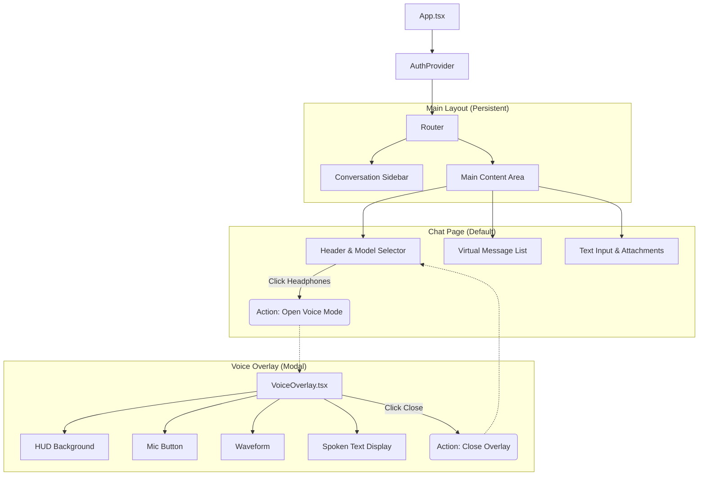
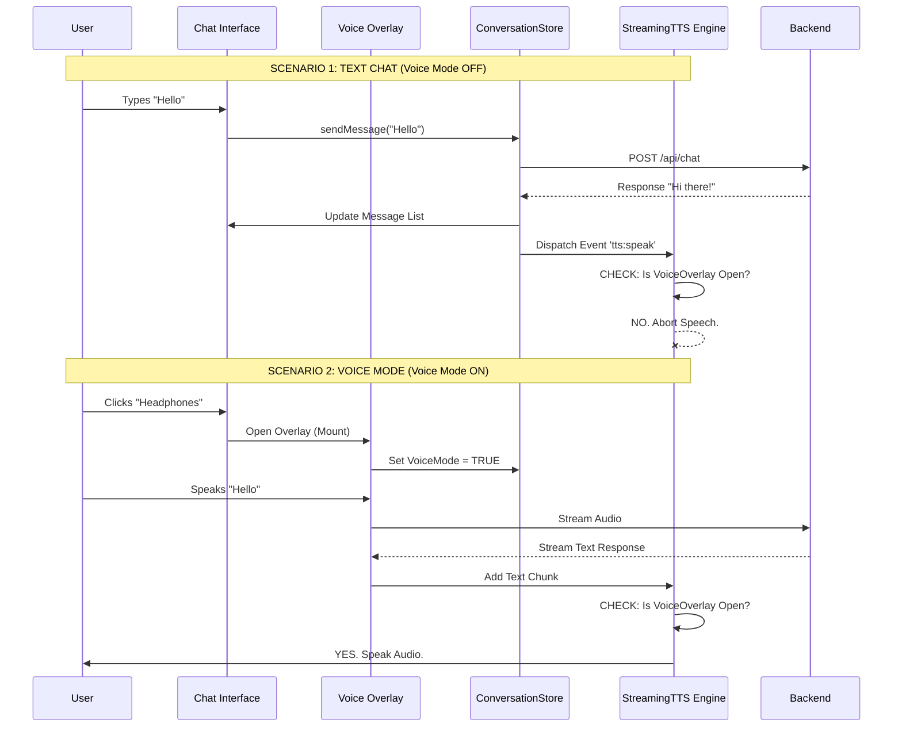

# Gnani Chat-First Migration: Deep Analysis & Architecture Report

## 1. Project Overview & Philosophy
**Current State**: Gnani is a "Voice-First" application where the primary interface is a HUD (Heads-Up Display) that listens immediately upon launch. It uses Electron for the shell, React (Vite) for the UI, and Node.js (Express+gRPC) for the backend. Use state is heavily tied to the microphone status (`idle`, `listening`, `processing`, `speaking`).

**Target State**: Gnani will become a "Chat-First" AI assistant (like ChatGPT/Gemini).
*   **Default Mode**: Text interface. Silent. No microphone access until requested.
*   **Voice Mode**: An immersive, optional overlay triggered by a button. Only in this mode does the AI speak aloud.
*   **One Brain**: The conversation history and context are shared seamlessly between both modes.

---

## 2. Comprehensive File Inventory & Analysis

### A. Frontend Core (`gnani-rnd/react/src`)
| Path | Component/File | Role in New Architecture |
| :--- | :--- | :--- |
| **`App.tsx`** | `App` | **Router Shell**. Needs to be updated to route `/` to the new Chat Layout instead of directly to `GnaniCore`. |
| **`main.tsx`** | `Root` | Entry point. Wraps App in `UserProvider`. No major changes needed. |
| **`index.css`** | Global Styles | Contains Tailwind base. Need to ensure "Chat" specific styles (message bubbles, code blocks) are globally available. |

### B. UI Components (`gnani-rnd/react/src/components`)
#### **1. The Layout Layer (New)**
*   **`layouts/MainLayout.tsx`** (Proposed): Will hold the persistent `ConversationSidebar` and the main `Outlet`.
*   **`gnani/VoiceOverlay.tsx`** (Proposed): A wrapper component that encapsulates the *entirety* of the current `GnaniCore` logic, but renders it inside a Z-Index 9999 modal.

#### **2. The Chat Interface (Evolution of `terminal`)**
| File | Current Role | Migration Plan |
| :--- | :--- | :--- |
| **`terminal/TerminalPanel.tsx`** | Slide-over chat overlay | **Promote to Main Page (`pages/ChatPage.tsx`)**. Remove "close/minimize" logic. Make it full width/height. |
| **`terminal/MessageBubble.tsx`** | Renders single msg | **Enhance**. Needs "Avatar" support, "Copy" button, and better "Thinking" state visualization. |
| **`terminal/TextInput.tsx`** | Bottom input box | **Enhance**. Needs to support "Center Stage" mode (when chat is empty/new) and "Bottom Bar" mode (when chat exists). |
| **`terminal/Virtuoso`** | Scroll Engine | Keep. It's excellent for performance with long chats. |

#### **3. The Voice Interface (Legacy `gnani`)**
| File | Current Role | Migration Plan |
| :--- | :--- | :--- |
| **`gnani/GnaniCore.tsx`** | Main Logic Controller | **Refactor**. Currently manages the *whole page*. functionality should be moved into `VoiceOverlay`. |
| **`gnani/MicButton.tsx`** | Central Interaction | Keep in Overlay. The visual anchor of Voice Mode. |
| **`gnani/HUDBackground.tsx`** | Visual Ambience | Keep in Overlay. Provides the "Sci-Fi" feel. |
| **`gnani/Waveform.tsx`** | Siri-like waves | Keep in Overlay. Only active when VAD is processing audio. |

### C. State Management (`gnani-rnd/react/src/store`)
| File | Responsibility | Changes Required |
| :--- | :--- | :--- |
| **`useConversationStore.ts`** | Chat History, CRUD | **Critical**. Already handles messaging. Needs to ensure `refreshConversation` is called immediately when switching back from Voice Mode. |
| **`useGnaniStore.ts`** | Voice State Machine | **Scope**. Ensure this store's `isListening` state *only* becomes true if `VoiceOverlay` is open. |
| **`useUserStore.ts`** | Auth & Profile | No changes. Works perfectly. |

### D. Utilities & Hooks
| File | Responsibility | Changes Required |
| :--- | :--- | :--- |
| **`utils/streamingTTS.ts`** | Text-to-Speech Engine | **GATE KEEPING**. Must check a "Voice Mode Active" flag before calling `speechSynthesis.speak`. |
| **`hooks/useAudioStream.ts`** | gRPC Audio Pipe | **Cleanup**. Ensure `stopStream()` is called explicitly when `VoiceOverlay` unmounts/closes. |

### E. Backend (`gnani-rnd-backend/src`)
*   **No major architectural changes needed**. The backend exposes:
    *   `POST /api/chat`: For text-based chat (used by Chat Interface).
    *   `gRPC StartSession/SendAudioStream`: For voice streaming (used by Voice Overlay).
    *   These are already decoupled, which is excellent.

---

## 3. Visual Architecture Diagrams

### A. New UI Layout Structure
This diagram shows how the components will nest in the new Chat-First application.



### B. Voice Gating Logic (The "Silence" Policy)
This flow ensures that Gnani **NEVER** speaks unless the user is explicitly in the Voice Overlay.



---

## 4. Implementation Plan: The "Voice-Gating" Strategy

The user's critical requirement is: **"If we are in voice mode then only the response will be speak by gnani or else we just show the text."**

### Step 1: Global UI State
We need a global state to track if the Voice Overlay is open.
*   **Location**: `src/hooks/useGnaniUIState.ts` (or a new `useAppModeStore.ts`).
*   **State**: `isVoiceModeOpen: boolean`.
*   **Action**: `setVoiceModeOpen(boolean)`.

### Step 2: The Gatekeeper (GnaniCore Refactor)
Currently, `GnaniCore.tsx` listens to `tts:speak`. We will wrap this logic in a check.

**Current Code (`GnaniCore.tsx`):**
```typescript
useEffect(() => {
  const handleTtsSpeak = (event: Event) => {
    // ... logic ...
    streamingTTSRef.current.addTextChunk(text);
  };
  window.addEventListener('tts:speak', handleTtsSpeak);
}, []);
```

**New Code Logic:**
```typescript
const { isVoiceModeOpen } = useAppModeStore();

useEffect(() => {
  const handleTtsSpeak = (event: Event) => {
    if (!isVoiceModeOpen) {
        console.log("TTS blocked because Voice Mode is closed.");
        return; 
    }
    // ... logic ...
    streamingTTSRef.current.addTextChunk(text);
  };
  window.addEventListener('tts:speak', handleTtsSpeak);
}, [isVoiceModeOpen]);
```

### Step 3: Stream Handling
The `useIPC` hook or `GnaniCore` processes incoming gRPC chunks. We must apply the same check there. If `!isVoiceModeOpen`, we acknowledge the chunk (so history updates) but do **not** forward it to `StreamingTTS`.

---

## 5. Visual Guide for New UI

**1. The Chat Page (Default)**
```
+---------------------------------------------------------------+
|  SIDEBAR      |  HEADER: [ Gnani 2.0 ] [Model: GPT-4]  [🎧]   |  <-- Toggle
|               +-----------------------------------------------+
|  - New Chat   |                                               |
|  - History    |                                               |
|    - Chat A   |         [ User Message ]                      |
|    - Chat B   |                                               |
|               |       [ Gnani Avatar ]                        |
|               |       [ Hello! How can I help?       ]        |
|               |       [ [Copy] [Regenerate]          ]        |
|               |                                               |
|               +-----------------------------------------------+
|  [ Settings ] |  [ + ] [ Type a message...              ] [^] |
+---------------+-----------------------------------------------+
```

**2. The Voice Overlay (Active)**
```
+---------------------------------------------------------------+
|                                                               |
|                  (Blurred Background of Chat)                 |
|                                                               |
|            [  HOLOGRAPHIC WAVEFORM ANIMATION  ]               |
|                                                               |
|                    [  LISTENING...  ]                         |
|                                                               |
|                     (  MIC BUTTON  )                          |
|                                                               |
|        "Sure, I can explain the theory of relativity..."      |
|             (Live Captions fading in and out)                 |
|                                                               |
|                     [ X CLOSE VOICE ]                         |
+---------------------------------------------------------------+
```

## 6. Recommendations & Next Steps

1.  **Approval**: Please review the **Voice Gating Logic** above. Is the strict "Silence in Chat" policy correct? (Yes based on your prompt).
2.  **Execution**: I am ready to start **Stage 1** of the migration plan:
    *   Create `src/pages/ChatPage.tsx` (Ported from Terminal).
    *   Create `src/components/gnani/VoiceOverlay.tsx`.
    *   Setup the Router in `App.tsx`.

Shall I proceed with creating the file structure for Stage 1?
