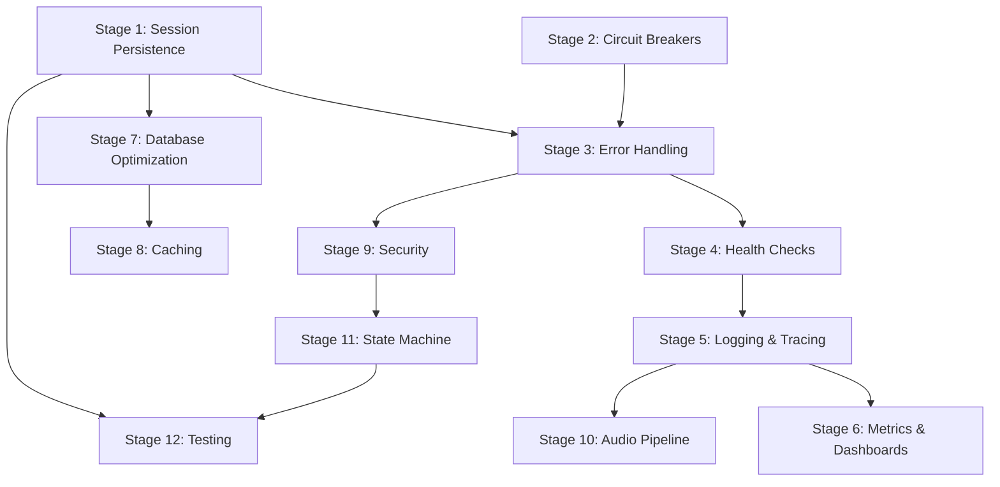

# Implementation Stages Overview

This directory contains detailed implementation prompts for upgrading Gnani to a production-grade single-LLM system.

## Stage Organization

### Month 1: Stability & Reliability (Weeks 1-4)
1. **Stage 1:** Session Persistence & Recovery (1 week)
2. **Stage 2:** Circuit Breakers & Fault Tolerance (1 week)
3. **Stage 3:** Error Handling & Retry Logic (1 week)
4. **Stage 4:** Health Checks & Readiness Probes (3 days)

### Month 2: Monitoring & Performance (Weeks 5-8)
5. **Stage 5:** Structured Logging & Distributed Tracing (1 week)
6. **Stage 6:** Metrics & Dashboards (1 week)
7. **Stage 7:** Database Optimization (1 week)
8. **Stage 8:** Caching & Performance (1 week)

### Month 3: Production Readiness (Weeks 9-12)
9. **Stage 9:** Security & Rate Limiting (1 week)
10. **Stage 10:** Audio Pipeline Enhancement (1 week)
11. **Stage 11:** State Machine Implementation (1 week)
12. **Stage 12:** Testing & Documentation (1 week)

## How to Use These Prompts

Each stage prompt is self-contained and includes:
- **Objective:** What this stage accomplishes
- **Current State:** Analysis of existing implementation
- **Implementation:** Detailed code examples and file structure
- **Testing:** Unit and integration test requirements
- **Verification:** Checklist of deliverables
- **Success Criteria:** Measurable outcomes

### Recommended Approach

1. **Read the prompt thoroughly** before starting implementation
2. **Follow the order** - stages have dependencies
3. **Complete verification checklist** before moving to next stage
4. **Run tests** after each stage
5. **Update documentation** as you implement

### Dependencies

## Quick Reference

| Stage | Priority | Time | Key Deliverables |
|-------|----------|------|------------------|
| 1 | P0 | 1w | Session persistence to MongoDB, recovery logic |
| 2 | P0 | 1w | Circuit breakers for all external deps |
| 3 | P0 | 1w | Standardized error handling, retry logic |
| 4 | P0 | 3d | Health/readiness endpoints, graceful shutdown |
| 5 | P0 | 1w | JSON logging, OpenTelemetry tracing |
| 6 | P0 | 1w | Prometheus metrics, Grafana dashboards |
| 7 | P1 | 1w | DB indexes, connection pooling, query optimization |
| 8 | P1 | 1w | Multi-layer caching, cache invalidation |
| 9 | P0 | 1w | Rate limiting, input validation, audit logging |
| 10 | P1 | 1w | Audio preprocessing (AEC/NS/AGC), adaptive VAD |
| 11 | P1 | 1w | Deterministic state machine for assistant |
| 12 | P1 | 1w | Unit tests (80%+), integration tests, docs |

## Success Metrics

After completing all stages, the system should achieve:

- ✅ **99.9% uptime** over 30 days
- ✅ **<200ms p95 latency** for text queries
- ✅ **<500ms p95 latency** for audio queries
- ✅ **Zero data loss** on backend restart
- ✅ **1000+ concurrent users** supported
- ✅ **80%+ test coverage**
- ✅ **Full observability** (logs, metrics, traces)

## Notes

- Each stage is designed to be completed by a single developer in the estimated time
- Stages can be parallelized where dependencies allow
- All code examples follow the existing project structure
- Testing is mandatory before moving to the next stage

---

For questions or issues, refer to the main report: `SINGLE_LLM_FOUNDATION_REPORT.md`
